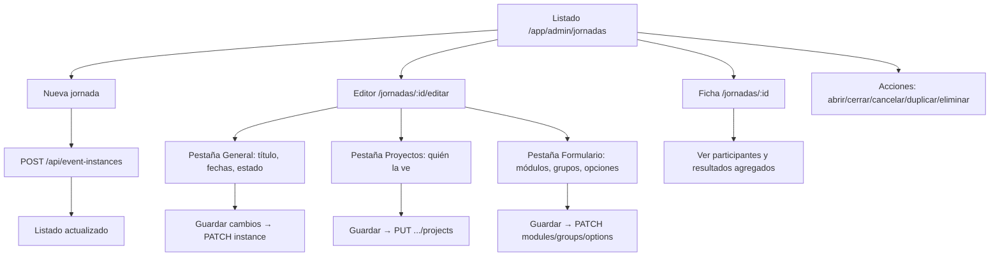

# Guía de defensa — Admin: Usuarios y Jornadas (frontend)

Documento para **entender y defender en un examen** los dos flujos administrativos del frontend Macabi:

1. **Creación y carga de usuarios** (`/app/admin/usuarios`)
2. **Creación y gestión de jornadas** (`/app/admin/jornadas`)

Está pensado para alguien con **poco conocimiento de React**. Combina:

- **Qué hace la app** (flujo funcional, diagramas, preguntas de examen).
- **Qué dice el código** — sección **[7. Apéndice — Código importante](#7-apéndice--código-importante-para-cuando-el-profesor-abre-el-repo)** con los archivos y fragmentos que suelen mirar en una defensa.

No hace falta memorizar línea por línea: hay que poder **ubicar** cada archivo y **explicar** qué hace el bloque clave (router → hook → api → mutation).

Para contexto general del stack y carpetas, ver [`GUIA-FRONTEND.md`](./GUIA-FRONTEND.md).  
Para auth, login y admin gastos (otro compañero), ver [`GUIA-FLUJOS-AUTH-GASTOS.md`](./GUIA-FLUJOS-AUTH-GASTOS.md).

> **Tip:** Si el profesor abre el IDE, empezá por la [sección 7](#7-apéndice--código-importante-para-cuando-el-profesor-abre-el-repo) y seguí el hilo router → hook → `*Api.ts`.

---

## 1. Antes de empezar: ideas mínimas

| Concepto | Explicación simple |
|----------|-------------------|
| **SPA** | Una sola página web que cambia de “pantalla” sin recargar el navegador. Cada pantalla es una **ruta** (URL). |
| **Ruta / URL** | Dirección del navegador. Ej.: `/app/admin/usuarios` abre la gestión de usuarios. |
| **Página (`pages/`)** | Archivo que corresponde a una ruta. Es **fina**: muestra la UI y delega la lógica. |
| **Feature (`features/`)** | Código de un **dominio** (usuarios, jornadas). Ahí están formularios, tablas, hooks y llamadas al API. |
| **Hook** | Función que concentra lógica reutilizable (estado, filtros, mutaciones). Ej.: `useAdminUsuariosPage`. |
| **TanStack Query** | Librería que **pide datos al servidor**, los cachea y los refresca. “Query” = leer; “Mutation” = escribir (crear, editar, borrar). |
| **Token** | Clave de sesión del usuario logueado. Se envía en cada llamada al backend para demostrar quién sos. |
| **Drawer** | Panel lateral (o inferior en celular) que se abre encima de la lista. |
| **Dialog** | Ventana modal centrada (ej. “Agregar usuario”). |

### Quién puede entrar

Solo usuarios con rol **`admin`**.

- El router envuelve `/app/admin/*` con `RequireAdmin` (`src/auth/RequireAdmin.tsx`).
- Si no sos admin, te redirige a `/app` (panel normal).

Rutas relevantes (definidas en `src/router.tsx`):

| Ruta | Pantalla |
|------|----------|
| `/app/admin/usuarios` | Listado y gestión de usuarios |
| `/app/admin/jornadas` | Listado de jornadas |
| `/app/admin/jornadas/:id` | Ficha de una jornada |
| `/app/admin/jornadas/:id/editar` | Editor completo (formulario) |
| `/aceptar-invitacion?token=...` | Pantalla pública donde la persona invitada crea su contraseña |

En el menú lateral admin (`layouts/AppShellLayout/navItems.ts`) aparecen **Jornadas** y **Usuarios**.

---

## 2. Flujo A — Usuarios (invitar, importar, listar, administrar)

### 2.1. Qué problema resuelve

Macabi **no tiene registro público**. Las cuentas se crean por **invitación**:

1. Un admin carga nombre + email (+ rol).
2. El backend envía un **correo con un link**.
3. La persona abre el link, elige contraseña y ya puede iniciar sesión.

Además, el admin puede **ver todos los usuarios**, **editarlos**, **cambiar rol**, **activar/desactivar** cuentas e **importar muchos** desde Excel/CSV.

### 2.2. Mapa visual del flujo

```mermaid
flowchart TD
  A[Admin entra a /app/admin/usuarios] --> B[Carga lista desde API]
  B --> C{Qué quiere hacer?}
  C -->|Agregar uno| D[Dialog Agregar usuario]
  C -->|Importar muchos| E[Dialog Importar Excel]
  C -->|Tocar fila| F[Drawer detalle usuario]
  D --> G[POST /api/users/invitations]
  E --> H[Varios POST invitaciones en lotes]
  G --> I[Email con link al invitado]
  H --> I
  I --> J[/aceptar-invitacion?token=...]
  J --> K[POST accept invitation + contraseña]
  K --> L[Redirige al login /]
  F --> M[Editar / rol / activar-desactivar]
  M --> N[PATCH o PUT al API]
```

### 2.3. Pantalla principal: listado

**Archivo:** `src/pages/admin/AdminUsuariosPage.tsx`  
**Lógica:** `src/features/users/hooks/useAdminUsuariosPage.ts`

#### Qué ve el admin

- Título **“Usuarios”** y dos botones:
  - **Importar** — carga masiva desde archivo.
  - **Agregar usuario** — invitación individual.
- Barra de **búsqueda** (nombre o correo).
- **Tabla** con nombre, correo, rol, estado y fecha de alta.
- **Paginación server-side** (`GET /api/users?page=&page_size=&q=`).

#### Cómo se cargan los usuarios (“carga” de la lista)

1. `useAdminUsuariosPage` mantiene `search`, `page` y un **`debouncedQ`** (~300 ms con `useDebouncedValue`) para no pegarle al API en cada tecla.
2. TanStack Query pide **solo la página actual**: `getUsers(token, { page, pageSize: PAGE_SIZE, q: debouncedQ })`.
3. La caché usa `queryKeys.users.adminList(token, page, debouncedQ)`.
4. Al cambiar la búsqueda, un `resetKey` vuelve a **página 1** (mismo patrón que jornadas y gastos admin).
5. El backend filtra con `q`, ordena por **`created_at DESC`** (fijo) y devuelve `{ data, total, total_pages }`.

**Dos cargas distintas (importante para el examen):**

| Uso | Hook / helper | Qué trae |
|-----|---------------|----------|
| **Tabla admin** | `useAdminUsuariosPage` → `getUsers` paginado | Una página + búsqueda server-side |
| **Pickers** (coordinador, miembros, participantes) | `useAdminUsers` → `fetchAllUsersForAdmin` | **Todos** los usuarios en memoria |

**Componentes de la lista:**

| Pieza | Archivo | Rol |
|-------|---------|-----|
| Tabla | `features/users/components/admin/UsersTable.tsx` | Muestra filas; click abre drawer |
| Badges rol/estado | `features/users/components/admin/UserBadges.tsx` | “Admin”, “Usuario”, activo/inactivo |
| Helpers fecha | `features/users/lib/userHelpers.ts` | Formato de fecha de alta |

**Código:** [7.2](#72-patrón-página-fina-adminusuariospage) · [7.3](#73-orquestador-useadminusuariospage) · [7.4](#74-listado-paginado-y-fetchallusersforadmin) · [7.5](#75-api-de-usuarios-usersapits)

### 2.4. Invitar un usuario (individual)

**UI:** `features/users/components/admin/InviteDialog.tsx`

#### Pasos para el admin

1. Clic en **Agregar usuario**.
2. Completa **nombre**, **correo** y **rol inicial** (Usuario o Admin).
3. Clic en **Enviar invitación**.

#### Qué pasa en el código

1. `handleInviteSubmit` valida que nombre y email no estén vacíos.
2. `inviteMutation` (en `useAdminUserMutations`) llama a `createUserInvitation` → **`POST /api/users/invitations`** con `{ name, email, role }`.
3. Si sale bien:
   - Toast de éxito (“recibirá un correo…”).
   - Se cierra el dialog y se limpia el formulario.
   - Se **invalida** la caché de usuarios para refrescar la lista.
4. Si falla (email duplicado, etc.), toast con el mensaje del servidor.

**Importante para el examen:** el admin **no define la contraseña**. Solo dispara la invitación; la contraseña la elige la persona invitada.

**Código:** [7.6](#76-invitación-individual-mutation--submit) · `InviteDialog.tsx` (solo UI del form)

### 2.5. Importar usuarios (masivo)

**UI:** `features/users/components/BulkInviteDialog.tsx`  
**Lógica:** `features/users/hooks/useBulkInviteFlow.ts` + `features/users/lib/bulkInviteSheet.ts`

#### Pasos para el admin

1. Clic en **Importar**.
2. Arrastra o elige un archivo **.xlsx, .xls o .csv**.
3. Opcional: descarga **plantilla** de ejemplo.
4. Ve una **vista previa**: filas válidas (✓) y filas con error (nombre vacío, email inválido).
5. Confirma **Enviar N invitaciones**.
6. Barra de progreso mientras envía.
7. Resumen: cuántas OK y cuántas fallaron (con motivo).

#### Detalles técnicos (sin React)

- El Excel se lee con la librería **xlsx** en el navegador (no sube el archivo entero al servidor como “import job”).
- Busca columnas cuyo nombre contenga “nombre” o “email/correo”.
- Todas las invitaciones masivas van con rol **`user`** (no admin).
- Envía en **lotes de 10** (`BATCH_SIZE`) llamando al mismo endpoint `POST /api/users/invitations` por fila.
- Filas inválidas se **omitien**; no frenan el resto.

**Código:** [7.7](#77-importación-masiva-bulkinvitesheetts)

### 2.6. Drawer: administrar un usuario existente

**UI:** `features/users/components/admin/UserDrawerContent.tsx`  
**Estado del drawer:** `features/users/hooks/useAdminUserDrawer.ts`

Se abre al hacer clic en una fila de la tabla.

#### Secciones del drawer

| Sección | Qué permite | API |
|---------|-------------|-----|
| **Proyectos** | Ver a qué proyectos pertenece (solo lectura + link al admin del proyecto) | Datos precargados con `useUserProjectsByUser` |
| **Estado de cuenta** | Desactivar o reactivar | `PATCH /api/users/:id/status` `{ active: true/false }` |
| **Rol** | Cambiar entre Usuario y Admin (solo si quien mira es admin) | `PATCH /api/users/:id/role` `{ role }` |
| **Datos del usuario** | Editar nombre y email | `PUT /api/users/:id` |
| **Cambiar contraseña** | Solo si es **tu propia cuenta** (`isOwnAccount`) | `changePassword` en auth API |

#### Reglas de negocio visibles en UI

- **No podés desactivar tu propia cuenta** desde el panel (evita quedar sin admin).
- Desactivar ≠ borrar: la persona **no puede loguearse**, pero la cuenta sigue existiendo y se puede reactivar.
- Al desactivar, aparece un **ConfirmDialog** de confirmación.

**Código:** [7.8](#78-mutaciones-del-drawer-useadminusermutationsts) · `UserDrawerContent.tsx` (UI) · `useAdminUserDrawer.ts` (validación editar/contraseña)

### 2.7. Lado del invitado (completar registro)

**Ruta pública:** `/aceptar-invitacion?token=...`  
**Archivo:** `src/pages/auth/AceptarInvitacionPage.tsx`

#### Pasos para la persona invitada

1. Abre el link del correo (lleva el `token` en la URL).
2. Elige **contraseña** y **confirmación** (mínimo 8 caracteres).
3. Clic en **Activar cuenta**.
4. Si todo OK → va al **login** (`/`).

#### Validaciones en frontend

- Token vacío → error (“pedile uno nuevo al admin”).
- Contraseñas distintas → error.
- Menos de 8 caracteres → error.

Llamada: `acceptInvitation({ token, password })` en `lib/api/auth.ts` (el backend valida que el token sea válido y de un solo uso).

**Código:** [7.9](#79-aceptar-invitación-pantalla-pública)

### 2.8. Archivos clave — usuarios

```
pages/admin/AdminUsuariosPage.tsx          ← Pantalla (orquesta todo)
features/users/
  hooks/
    useAdminUsuariosPage.ts                ← Estado de la página
    useAdminUsers.ts                     ← Query: todos los usuarios (pickers)
    useAdminUserMutations.ts             ← Invitar, rol, estado, editar
    useAdminUserDrawer.ts                ← Formularios del drawer
    useBulkInviteFlow.ts                 ← Flujo importación Excel
  api/usersApi.ts                        ← Funciones HTTP
  lib/
    fetchAllUsersForAdmin.ts             ← Pagina hasta traer todos (pickers)
    bulkInviteSheet.ts                   ← Parseo Excel + envío por lotes
    userHelpers.ts                       ← Formato fecha, labels
  components/admin/
    UsersTable.tsx
    InviteDialog.tsx
    UserDrawerContent.tsx
    UserBadges.tsx
  components/BulkInviteDialog.tsx
pages/auth/AceptarInvitacionPage.tsx     ← Invitado crea contraseña
```

### 2.9. Preguntas típicas de examen — usuarios

| Pregunta | Respuesta corta |
|----------|-----------------|
| ¿Cómo se crea un usuario? | Por **invitación**: admin envía nombre+email; la persona define contraseña en `/aceptar-invitacion`. |
| ¿Hay registro público? | **No.** Solo invitación. |
| ¿Dónde se listan? | `AdminUsuariosPage`; `GET /api/users` paginado con `q` (búsqueda en servidor). |
| ¿Cuándo se traen todos? | `useAdminUsers` + `fetchAllUsersForAdmin` — solo pickers, no la tabla. |
| ¿Cómo se importan muchos? | Excel/CSV en el navegador → preview → mismo endpoint de invitación en lotes de 10. |
| ¿Qué es el drawer? | Panel de detalle al clickear un usuario: editar, rol, activar/desactivar. |
| ¿Por qué no desactivar mi cuenta? | Protección para que un admin no se quede afuera del sistema. |
| ¿Dónde está la lógica vs la UI? | UI en `pages/` y `components/`; lógica en `hooks/` y `api/`. |
| ¿Qué pasa si falla una invitación? | Toast de error; en importación masiva, esa fila queda en “fallidas” con mensaje. |

---

## 3. Flujo B — Jornadas (crear, editar, publicar, revisar)

### 3.1. Qué es una “jornada” en la app

Una **jornada** es un **evento** con:

- **Datos generales:** título, tipo, fecha de inicio, límite para responder, **estado**.
- **Proyectos** que pueden verla y responder.
- **Formulario modular:** uno o más **módulos** (asistencia, comida, transporte…), cada uno con **grupos de preguntas** y **opciones**.

Los participantes responden desde `/app/jornadas/:id/responder` (fuera de este doc, pero conviene mencionarlo: el admin **arma** la jornada; el usuario **responde**).

### 3.2. Mapa visual del flujo admin



### 3.3. Estados de una jornada

Definidos en API (labels en español en `features/events/lib/eventLabels.ts`):

| Estado (API) | Label UI | Significado |
|--------------|----------|-------------|
| `draft` | Borrador | En preparación; no orientada a participantes. |
| `open` | Abierta | Los usuarios **pueden enviar respuestas**. |
| `closed` | Respuestas cerradas | Ya no se aceptan respuestas nuevas (admin puede reabrir). |
| `cancelled` | Cancelada | Jornada anulada; no se responde. |

**Para el examen:** abrir/cerrar respuestas es cambiar `status` a `open` o `closed`. Cancelar es `cancelled` (distinto de eliminar).

### 3.4. Listado de jornadas

**Archivo:** `src/pages/admin/AdminJornadasPage.tsx`  
**Lógica:** `src/features/events/hooks/useAdminJornadasPage.ts` + `useAdminJornadas.ts`

#### Qué ve el admin

- Botón **Nueva jornada**.
- Búsqueda por título.
- Filtro por **estado** (todos, borrador, abierta, etc.).
- Tabla (desktop) y lista (mobile) con título (link a ficha), fecha de inicio, badge de estado.
- Menú **Acciones** por fila (`JornadaActionsMenu`).
- Paginación **server-side** (`GET /api/event-instances?page=&page_size=&q=&status=`).
- Búsqueda con **debounce** (~300 ms); filtro de estado resetea a página 1 al cambiar.
- Orden fijo en backend: **`starts_at DESC`**.

#### Acciones rápidas desde el listado

| Acción | Efecto |
|--------|--------|
| Ver ficha | Navega a `/app/admin/jornadas/:id` |
| Editar formulario | Navega a `.../editar` |
| Duplicar | Abre dialog; copia estructura en **borrador** con nuevas fechas |
| Abrir respuestas | `status → open` |
| Cerrar respuestas | `status → closed` |
| Cancelar jornada | Confirmación → `status → cancelled` |
| Eliminar | Confirmación → `DELETE /api/event-instances/:id` (irreversible) |

Al cambiar estado desde el listado, el código **primero lee** el detalle (`getEventDetail`) y **después** envía un PATCH con todos los campos + el nuevo status (el API espera el objeto completo).

**Código:** [7.1](#71-rutas-admin-y-requireadmin) · [7.11](#711-cambiar-estado-desde-el-listado-useadminjornadaspage)

### 3.5. Crear una jornada (primer paso)

**UI:** `features/events/components/admin/CreateJornadaDialog.tsx`

#### Pasos

1. Clic **Nueva jornada**.
2. Completar:
   - **Título** (default “Nueva jornada”).
   - **Inicio** (obligatorio, `datetime-local`).
   - **Límite de respuestas** (opcional).
   - **Estado inicial** (borrador, abierta o cerrada).
3. Clic **Crear jornada**.

#### API

`POST /api/event-instances` con:

```json
{
  "title": "...",
  "starts_at": "ISO8601",
  "response_deadline_at": "ISO8601 o null",
  "status": "draft | open | closed",
  "type": "activity"
}
```

Tras crear, se invalida la lista y aparece toast. **Todavía no tiene formulario**: hay que ir al **editor** para agregar módulos y proyectos.

**Código:** [7.10](#710-crear-jornada-createjornadadialogtsx)

### 3.6. Editor de jornada (donde se “arma” el evento)

**Ruta:** `/app/admin/jornadas/:id/editar`  
**Archivo:** `src/pages/admin/AdminJornadaBuilderPage.tsx`  
**Lógica:** `src/features/events/hooks/useJornadaBuilder.ts`

Tres pestañas con indicador **punto ámbar** si hay cambios sin guardar:

#### Pestaña 1 — Datos generales

- Título, tipo (`activity` / `custom`), estado, inicio, límite respuestas.
- Al guardar → `PATCH /api/event-instances/:id`.

#### Pestaña 2 — Proyectos participantes

- `ProjectPicker`: checkboxes de todos los proyectos del sistema.
- Define qué proyectos **ven la jornada** en listados y al responder.
- Al guardar → `PUT /api/event-instances/:id/projects` con `{ project_ids: [...] }`.

#### Pestaña 3 — Formulario · módulos

Estructura jerárquica:

```
Jornada
 └── Módulo (ej. “Asistencia”, “Comida”)
      └── Grupo de opciones (ej. “¿Venís?”, tipo una opción / varias / texto)
           └── Opciones (ej. “Sí”, “No”, con cupo opcional)
```

**Operaciones inmediatas** (crean en servidor al instante):

- **+ Módulo** → `POST /api/event-modules`
- **+ Grupo** en un módulo → `POST /api/event-option-groups`
- **+ Opción** en un grupo → `POST /api/event-options`

**Ediciones de texto/tipo/proyectos del módulo** quedan en memoria local hasta pulsar **Guardar cambios** (botón del header).

Componente principal: `features/events/components/EventModuleEditorCard.tsx`  
Cada tarjeta registra una función “guardar” en el hook padre; `handleSaveAll` ejecuta **en paralelo**:

1. Metadata si cambió (`metaDirty`).
2. Proyectos de la jornada si cambió (`projectsDirty`).
3. Cada módulo con cambios pendientes (`moduleDirtyCount`).

**Detalle importante:** agregar módulo/grupo/opción **sí** va al servidor al clic; cambiar títulos o tipos requiere **Guardar cambios**.

**Código:** [7.12](#712-editor-usejornadabuilderts-guardar-y-módulos) · [7.13](#713-capas-del-api-eventsapits) · [7.14](#714-pestañas-del-editor-adminjornadabuilderpage)

### 3.7. Ficha de jornada (solo lectura + resultados)

**Ruta:** `/app/admin/jornadas/:id`  
**Archivo:** `src/pages/admin/AdminJornadaDetailPage.tsx`  
**Lógica:** `useAdminJornadaDetailPage.ts`

Muestra:

- Resumen: estado, fechas, tipo, proyectos vinculados, cantidad de módulos.
- **Participantes** que ya respondieron (`GET .../participant-responses`).
- **Resultados agregados** por módulo (`GET /api/event-modules/:id/response-summary`).
- Botones: **Volver**, **Editar**, **Eliminar**.

Es la pantalla para **controlar asistencia/opciones elegidas** sin entrar al editor.

### 3.8. Duplicar una jornada

**UI:** `features/events/components/admin/DuplicateJornadaDialog.tsx`  
**Lógica API:** `duplicateEventFromDetail` en `features/events/api/eventsApi.ts`

1. Admin elige jornada origen → Duplicar.
2. Indica nuevo título y fechas.
3. El frontend:
   - Crea instancia nueva en **borrador**.
   - Copia proyectos de la jornada.
   - Recorre módulos, grupos y opciones creando clones vía POST encadenados.

Útil para jornadas repetitivas (ej. cada fin de semana misma estructura).

### 3.9. Archivos clave — jornadas

```
pages/admin/
  AdminJornadasPage.tsx              ← Listado + acciones
  AdminJornadaDetailPage.tsx         ← Ficha + resultados
  AdminJornadaBuilderPage.tsx        ← Editor 3 pestañas
features/events/
  hooks/
    useAdminJornadasPage.ts          ← Filtros, mutaciones listado
    useAdminJornadas.ts              ← Query listado paginado
    useJornadaBuilder.ts             ← Editor: meta, proyectos, módulos
    useAdminJornadaDetailPage.ts     ← Ficha + summaries
  api/eventsApi.ts                   ← Todas las llamadas HTTP
  lib/eventLabels.ts                 ← Traducción estados/tipos
  lib/datetimeLocal.ts               ← Conversión fechas input ↔ ISO
  components/admin/
    CreateJornadaDialog.tsx
    DuplicateJornadaDialog.tsx
    JornadaActionsMenu.tsx
    ParticipantesSection.tsx
    ResultadosAgregadosCard.tsx
  components/
    EventModuleEditorCard.tsx        ← Editor de un módulo
    EventModuleGroupEditor.tsx
    EventStatusBadge.tsx
features/projects/components/ProjectPicker.tsx
```

### 3.10. Endpoints HTTP usados (resumen)

| Acción | Método | Ruta |
|--------|--------|------|
| Listar jornadas | GET | `/api/event-instances?page=&page_size=` |
| Detalle | GET | `/api/event-instances/:id` |
| Crear | POST | `/api/event-instances` |
| Editar metadata | PATCH | `/api/event-instances/:id` |
| Eliminar | DELETE | `/api/event-instances/:id` |
| Asignar proyectos (jornada) | PUT | `/api/event-instances/:id/projects` |
| Crear/editar/borrar módulos | POST/PATCH/DELETE | `/api/event-modules/...` |
| Proyectos por módulo | PUT | `/api/event-modules/:id/projects` |
| Grupos y opciones | POST/PATCH/DELETE | `/api/event-option-groups/...`, `/api/event-options/...` |
| Participantes | GET | `/api/event-instances/:id/participant-responses` |
| Resumen respuestas | GET | `/api/event-modules/:id/response-summary` |

### 3.11. Preguntas típicas de examen — jornadas

| Pregunta | Respuesta corta |
|----------|-----------------|
| ¿Cuál es la diferencia entre listado, ficha y editor? | **Listado** = todas las jornadas; **ficha** = ver resultados; **editor** = armar formulario y configuración. |
| ¿Qué estados existen? | Borrador, abierta, respuestas cerradas, cancelada. |
| ¿Cuándo pueden responder los usuarios? | Cuando `status === open` y están en un proyecto asignado. |
| ¿Dónde se eligen los proyectos? | Pestaña **Proyectos** del editor (+ restricción opcional por módulo). |
| ¿Qué es un módulo? | Bloque del formulario (asistencia, comida, etc.) con grupos y opciones. |
| ¿Por qué “Guardar cambios” y también “+ Módulo”? | Crear estructura nueva es **inmediato**; editar textos/tipos acumula cambios hasta guardar. |
| ¿Cómo se duplica? | Dialog pide fechas → frontend clona vía varios POST (función `duplicateEventFromDetail`). |
| ¿Eliminar vs cancelar? | **Cancelar** cambia estado; **eliminar** borra jornada, formulario y **todas las respuestas** (irreversible). |
| ¿Dónde se traducen los estados al español? | `features/events/lib/eventLabels.ts` (el API sigue en inglés). |

---

## 4. Comparación rápida entre ambos flujos

| Aspecto | Usuarios | Jornadas |
|---------|----------|----------|
| Pantalla principal | Una (`AdminUsuariosPage`) | Tres (listado, ficha, editor) |
| Paginación | Servidor (`GET /api/users?q=`) | Servidor (`q` + `status`) |
| Creación inicial | Dialog invitación o Excel | Dialog “Nueva jornada” |
| Edición profunda | Drawer lateral | Editor con 3 pestañas |
| Flujo externo | Invitado en `/aceptar-invitacion` | Participante en `/app/jornadas/:id/responder` |
| Feature folder | `features/users/` | `features/events/` |
| Patrón página | `useAdminUsuariosPage` concentra todo | Varios hooks por pantalla |

---

## 5. Cómo estudiar para defender el código

1. **Recorré la app** como admin: invitá un usuario de prueba, importá 2 filas de Excel, abrí el drawer, creá una jornada borrador, agregá un módulo, abrila, mirá la ficha.
2. **Leé la sección 7** con el IDE abierto en paralelo: cada bloque tiene ruta de archivo y “qué decir”.
3. **Seguí la ruta en el router** (`router.tsx`): URL → componente de `pages/`.
4. **Entrá al hook** de esa página: ahí está el “guion” (queries, mutations, validaciones).
5. **Bajá al API** (`usersApi.ts` o `eventsApi.ts`): qué endpoint y qué método HTTP.
6. **No memorices JSX**: memorizá **secuencia** (usuario hace X → código llama Y → servidor responde Z → UI muestra toast/lista nueva).

### Frase modelo para el examen

> “La pantalla `AdminUsuariosPage` es solo la vista. La lógica vive en `useAdminUsuariosPage`, que pide usuarios paginados con `GET /api/users?q=` (búsqueda con debounce en servidor) y mutations para invitar o cambiar rol. `fetchAllUsersForAdmin` queda solo para pickers donde hace falta la lista completa. Cuando el admin envía una invitación, el front hace POST a `/api/users/invitations`; la persona completa el registro en `AceptarInvitacionPage`, que no requiere estar logueada.”

> “Las jornadas se gestionan en tres niveles: listado con filtros y acciones rápidas, editor con pestañas General/Proyectos/Formulario, y ficha para ver respuestas. Crear la instancia es un POST; el formulario modular se construye con módulos, grupos y opciones en endpoints separados, y el botón Guardar cambios sincroniza las ediciones pendientes.”

---

## 6. Glosario de archivos compartidos (ambos flujos)

| Archivo | Uso en ambos flujos |
|---------|---------------------|
| `hooks/useAuth.ts` | Token y usuario logueado |
| `auth/RequireAdmin.tsx` | Protege rutas admin |
| `lib/api/apiClient.ts` | `apiRequest`: fetch con token y manejo de errores |
| `lib/queryKeys.ts` | Claves de caché TanStack Query |
| `components/PageHeader.tsx` | Título + acciones de cada pantalla |
| `components/data/DataToolbar.tsx` | Búsqueda + filtros |
| `components/data/PaginationControls.tsx` | Paginación server-side |
| `hooks/useDebouncedValue.ts` | Retrasa `q` ~300 ms antes de consultar al API |
| `components/ConfirmDialog.tsx` | Confirmaciones destructivas |

---

## 7. Apéndice — Código importante (para cuando el profesor abre el repo)

Los bloques siguientes son **copias reales** del código (pueden recortarse). Cada uno incluye **archivo**, **qué mirar** y **frase para defender**.

Convención: `// ...` indica líneas omitidas.

---

### 7.1. Rutas admin y RequireAdmin

**Archivos:** `src/router.tsx` · `src/auth/RequireAdmin.tsx`

El admin vive bajo `/app/admin/*`. Sin rol `admin`, React Router redirige al panel normal.

```tsx
// src/router.tsx — rutas admin (recorte)
{
  path: 'admin',
  element: <RequireAdmin />,
  children: [
    { index: true, element: <Navigate to="jornadas" replace /> },
    { path: 'jornadas', element: <AdminJornadasPage /> },
    { path: 'jornadas/:id', element: <AdminJornadaDetailPage /> },
    { path: 'jornadas/:id/editar', element: <AdminJornadaBuilderPage /> },
    // ...
    { path: 'usuarios', element: <AdminUsuariosPage /> },
  ],
}
```

```tsx
// src/auth/RequireAdmin.tsx — completo (11 líneas)
export function RequireAdmin() {
  const { user } = useAuth()
  if (user?.role !== 'admin') {
    return <Navigate to="/app" replace />
  }
  return <Outlet />
}
```

**Qué decir:** “La protección no está en cada página suelta: el router monta `RequireAdmin` como layout padre de todo `/app/admin`. Si `user.role !== 'admin'`, no renderiza hijos y manda a `/app`.”

---

### 7.2. Patrón página fina — AdminUsuariosPage

**Archivo:** `src/pages/admin/AdminUsuariosPage.tsx`

La página **no** contiene lógica de negocio: obtiene auth, llama al hook, renderiza componentes.

```tsx
export default function AdminUsuariosPage() {
  const { token, user: me, isRestoring } = useAuth()

  const {
    search, setSearch, page, setPage, totalPages,
    pageRows, countLabel, usersQuery, drawer,
    handleInviteSubmit, /* ... */
  } = useAdminUsuariosPage({ token, me, isRestoring })

  return (
    <div className="min-h-screen">
      <PageHeader
        title="Usuarios"
        action={
          <>
            <ActionButton onClick={() => setBulkOpen(true)}>Importar</ActionButton>
            <ActionButton onClick={() => setInviteOpen(true)}>Agregar usuario</ActionButton>
          </>
        }
      />
      <DataToolbar search={search} onSearch={setSearch} countLabel={countLabel} />
      <UsersTable pageRows={pageRows} onOpenDrawer={drawer.openDrawer} />
      <PaginationControls page={page} totalPages={totalPages} onPageChange={setPage} />
      <Drawer open={Boolean(selected)} onOpenChange={...}>
        <UserDrawerContent user={selected} /* ... */ />
      </Drawer>
      <BulkInviteDialog open={bulkOpen} token={token!} onDone={invalidateUsers} />
      <InviteDialog open={inviteOpen} onSubmit={handleInviteSubmit} /* ... */ />
    </div>
  )
}
```

**Qué decir:** “Seguimos el patrón del proyecto: `pages/` fina, `features/users/hooks/useAdminUsuariosPage` concentra estado y mutaciones, `components/admin/` son piezas de UI.”

---

### 7.3. Orquestador — useAdminUsuariosPage

**Archivo:** `src/features/users/hooks/useAdminUsuariosPage.ts`

Acá se **conectan** query paginada de usuarios, mutaciones, drawer y búsqueda con debounce.

```tsx
export function useAdminUsuariosPage({ token, me, isRestoring }: Args) {
  const [search, setSearch] = useState('')
  const [page, setPage] = useState(1)

  const debouncedQ = useDebouncedValue(search.trim())
  const resetKey = debouncedQ
  const [prevResetKey, setPrevResetKey] = useState(resetKey)
  if (resetKey !== prevResetKey) {
    setPrevResetKey(resetKey)
    setPage(1)
  }

  const usersQuery = useQuery({
    queryKey: queryKeys.users.adminList(token, page, debouncedQ),
    enabled: Boolean(token) && !isRestoring,
    queryFn: () => getUsers(token!, { page, pageSize: PAGE_SIZE, q: debouncedQ }),
  })

  const pageRows = usersQuery.data?.data ?? []
  const totalPages = usersQuery.data?.total_pages ?? 1

  function handleInviteSubmit(e: React.FormEvent) {
    e.preventDefault()
    if (!inviteName.trim() || !inviteEmail.trim()) {
      toast.error('Nombre y email son obligatorios')
      return
    }
    inviteMutation.mutate(
      { name: inviteName.trim(), email: inviteEmail.trim().toLowerCase(), role: inviteRole },
      { onSuccess: () => { setInviteOpen(false); /* limpia form */ } },
    )
  }
  // drawer, mutaciones, countLabel…
}
```

**Qué decir:** “Este hook es el ‘director de orquesta’: pide **una página** al servidor con `q` debounced, resetea paginación al buscar, y concentra invitaciones y drawer. No usa `fetchAllUsersForAdmin` — eso queda en `useAdminUsers` para otros flujos.”

---

### 7.4. Listado paginado y fetchAllUsersForAdmin

**Archivos:** `useAdminUsuariosPage.ts` (tabla) · `useAdminUsers.ts` · `fetchAllUsersForAdmin.ts` (pickers)

#### Tabla admin — una página + búsqueda server-side

```tsx
// useAdminUsuariosPage.ts (recorte)
const debouncedQ = useDebouncedValue(search.trim())

const usersQuery = useQuery({
  queryKey: queryKeys.users.adminList(token, page, debouncedQ),
  queryFn: () => getUsers(token!, { page, pageSize: PAGE_SIZE, q: debouncedQ }),
})
```

**Qué decir:** “La tabla no trae todos los usuarios. Pide `GET /api/users?page=N&page_size=20&q=texto`. El debounce evita un request por tecla.”

#### Pickers — lista completa en caché

```tsx
// useAdminUsers.ts
export function useAdminUsers(token, isRestoring) {
  return useQuery({
    queryKey: queryKeys.users.all(token),
    enabled: Boolean(token) && !isRestoring,
    queryFn: () => fetchAllUsersForAdmin(token!),
    staleTime: 2 * 60_000,
  })
}

// fetchAllUsersForAdmin.ts
export function fetchAllUsersForAdmin(token: string): Promise<UserDTO[]> {
  return fetchAllPages((page) => getUsers(token, { page, pageSize: 100 }), 30)
}
```

**Qué decir:** “Cuando un combo necesita **todos** los nombres (coordinador de proyecto, miembros), `fetchAllPages` recorre el API hasta juntar la lista. Es distinto del listado admin, que pagina en servidor.”

---

### 7.5. API de usuarios — usersApi.ts

**Archivo:** `src/features/users/api/usersApi.ts`

Capa fina sobre `apiRequest`. **Todas** las operaciones admin de usuarios pasan por acá.

```tsx
export async function createUserInvitation(token, body) {
  return apiRequest('/api/users/invitations', { method: 'POST', token, body })
}

export async function getUsers(token, params = {}) {
  const { page = 1, pageSize = 20, q } = params
  const search = new URLSearchParams({ page: String(page), page_size: String(pageSize) })
  if (q?.trim()) search.set('q', q.trim())
  return apiRequest(`/api/users?${search}`, { method: 'GET', token })
}

export async function updateUserRole(token, id, body) {
  return apiRequest(`/api/users/${id}/role`, { method: 'PATCH', token, body })
}

export async function updateUserStatus(token, id, body) {
  return apiRequest(`/api/users/${id}/status`, { method: 'PATCH', token, body })
}

export async function updateUser(token, id, body) {
  return apiRequest(`/api/users/${id}`, { method: 'PUT', token, body })
}
```

**Qué decir:** “No llamamos `fetch` suelto en los componentes: `usersApi.ts` centraliza endpoints y tipos. El token JWT va en cada request vía `apiClient`.”

---

### 7.6. Invitación individual — mutation + submit

**Archivo:** `src/features/users/hooks/useAdminUserMutations.ts`

```tsx
const inviteMutation = useMutation({
  mutationFn: (body: { name: string; email: string; role: 'user' | 'admin' }) =>
    createUserInvitation(token!, body),
  onSuccess: async (data) => {
    toast.success(
      data.message ?? 'Invitación enviada: la persona recibirá un correo para crear su cuenta.',
    )
    await invalidateUsers()
  },
  onError: (e: unknown) => {
    const msg = e instanceof ApiError ? e.message : 'No se pudo enviar la invitación.'
    toast.error(msg)
  },
})
```

**Qué decir:** “`useMutation` encapsula el POST. En éxito invalidamos la query de usuarios (`invalidateQueries`) para refrescar la tabla, y mostramos toast. El mail lo manda el backend, no el front.”

---

### 7.7. Importación masiva — bulkInviteSheet.ts

**Archivo:** `src/features/users/lib/bulkInviteSheet.ts`

```tsx
export const BATCH_SIZE = 10

export async function sendBulkInviteBatch(token, batch) {
  const settled = await Promise.allSettled(
    batch.map((row) =>
      createUserInvitation(token, { name: row.name, email: row.email, role: 'user' }),
    ),
  )
  return settled.map((r, i) => ({
    ...batch[i],
    status: r.status === 'fulfilled' ? 'success' : 'error',
    message: r.status === 'rejected' ? /* mensaje ApiError */ : undefined,
  }))
}
```

El parseo del Excel (`parseBulkInviteSheet`) usa **xlsx**, detecta columnas “nombre”/“email”, valida formato, y `useBulkInviteFlow` envía en lotes de 10.

**Qué decir:** “No hay endpoint de ‘import bulk’: el front parsea el archivo y repite el mismo POST de invitación. `Promise.allSettled` permite que una fila falle sin cancelar el lote.”

---

### 7.8. Mutaciones del drawer — useAdminUserMutations.ts

```tsx
const roleMutation = useMutation({
  mutationFn: ({ id, role }) => updateUserRole(token!, id, { role }),
  onSuccess: (_, vars) => {
    invalidateUsers()
    setSelected((prev) => (prev ? { ...prev, role: vars.role } : prev))
  },
})

const statusMutation = useMutation({
  mutationFn: ({ id, active }) => updateUserStatus(token!, id, { active }),
  onSuccess: (_, vars) => {
    invalidateUsers()
    setSelected((prev) => (prev ? { ...prev, active: vars.active } : prev))
  },
})
```

En `UserDrawerContent.tsx`, la regla de no desactivar la propia cuenta:

```tsx
{!isOwnAccount ? (
  <ActionButton onClick={onConfirmDeactivate}>Desactivar cuenta</ActionButton>
) : (
  <p>No podés desactivar tu propia cuenta desde este panel...</p>
)}
```

**Qué decir:** “Además de invalidar la lista, actualizamos `selected` en memoria para que el drawer refleje el cambio sin cerrarse. La UI impide desactivar `me.id === selected.id`.”

---

### 7.9. Aceptar invitación (pantalla pública)

**Archivo:** `src/pages/auth/AceptarInvitacionPage.tsx`

Ruta **fuera** de `/app` — no requiere login. El token viene en query string.

```tsx
export default function AceptarInvitacionPage() {
  const [searchParams] = useSearchParams()
  const token = searchParams.get('token') ?? ''

  const mutation = useMutation({
    mutationFn: () => acceptInvitation({ token: token.trim(), password }),
    onSuccess: () => navigate('/', { replace: true }),
  })

  const handleSubmit = (e: React.FormEvent) => {
    e.preventDefault()
    if (!token.trim()) { setError('El link de invitación no es válido...'); return }
    if (password.length < 8) { setError('La contraseña debe tener al menos 8 caracteres'); return }
    if (password !== confirm) { setError('Las contraseñas no coinciden'); return }
    mutation.mutate()
  }
  // formulario contraseña + confirmación
}
```

**Qué decir:** “Cierra el circuito de alta: admin invita → mail con `?token=` → esta página POSTea `acceptInvitation` → redirige al login. Validación mínima en front; el backend valida token expirado/usado.”

---

### 7.10. Crear jornada — CreateJornadaDialog.tsx

**Archivo:** `src/features/events/components/admin/CreateJornadaDialog.tsx`

```tsx
const createMut = useMutation({
  mutationFn: async () => {
    if (!startsLocal) throw new Error('Indicá fecha y hora de inicio')
    await createEventInstance(token, {
      title,
      starts_at: fromDatetimeLocalValue(startsLocal),
      response_deadline_at: deadlineLocal ? fromDatetimeLocalValue(deadlineLocal) : null,
      status: statusDraft,
      type: 'activity',
    })
  },
  onSuccess: async () => {
    onCreated()
    onOpenChange(false)
    await qc.invalidateQueries({ queryKey: queryKeys.events.adminListRoot() })
  },
})
```

**Qué decir:** “Creación mínima: solo metadata de la instancia. `fromDatetimeLocalValue` convierte el input `datetime-local` del navegador a ISO para el API. Después hay que ir al editor a armar módulos.”

---

### 7.11. Cambiar estado desde el listado — useAdminJornadasPage

**Archivo:** `src/features/events/hooks/useAdminJornadasPage.ts`

```tsx
const patchStatus = useMutation({
  mutationFn: async ({ id, status }) => {
    setPendingId(id)
    const cur = await getEventDetail(token!, id)
    const inst = cur.instance
    await patchEventInstance(token!, id, {
      title: inst.title,
      type: inst.type,
      starts_at: inst.starts_at,
      response_deadline_at: inst.response_deadline_at ?? null,
      status,  // ← único campo que cambiamos en la práctica
    })
  },
  onSuccess: async () => {
    setPendingId(null)
    toast.success('Estado actualizado.')
    await qc.invalidateQueries({ queryKey: queryKeys.events.adminListRoot() })
  },
})
```

**Qué decir:** “El PATCH del backend espera el cuerpo completo de la jornada, no solo el status. Por eso primero hacemos GET del detalle y reenviamos todos los campos con el nuevo `status`. `pendingId` muestra spinner en la fila que se está actualizando.”

---

### 7.12. Editor — useJornadaBuilder.ts (guardar y módulos)

**Archivo:** `src/features/events/hooks/useJornadaBuilder.ts`

**Dirty flags** — saber si hay cambios sin guardar:

```tsx
const anythingDirty = metaDirty || projectsDirty || moduleDirtyCount > 0
```

**Guardar todo** — un solo botón dispara varias mutaciones en paralelo:

```tsx
const handleSaveAll = async () => {
  setGlobalSaving(true)
  try {
    const calls: Promise<unknown>[] = []
    if (metaDirty) calls.push(saveMeta.mutateAsync())
    if (projectsDirty) calls.push(saveEventProjects.mutateAsync())
    for (const saver of moduleSavers.current) calls.push(saver())
    await Promise.all(calls)
    toast.success('Cambios guardados correctamente.')
  } catch (e) {
    toast.error(e instanceof Error ? e.message : 'Error al guardar')
  } finally {
    setGlobalSaving(false)
  }
}
```

**Agregar módulo** — efecto inmediato en servidor (distinto de editar texto):

```tsx
const addModule = useMutation({
  mutationFn: async () => {
    const sort =
      (detailQ.data?.modules.reduce((m, x) => Math.max(m, x.module.sort_order), -1) ?? -1) + 1
    await createEventModule(token!, {
      event_instance_id: id,
      title: 'Nuevo módulo',
      type: 'custom',
      sort_order: sort,
      is_required: false,
    })
  },
  onSuccess: invalidateDetail,
})
```

Cada `EventModuleEditorCard` registra su función `saver` en `moduleSavers` vía `registerModuleSaver` — patrón para guardar N módulos editados a la vez.

**Qué decir:** “Hay dos velocidades: crear/borrar módulo es instantáneo (POST/DELETE); cambiar títulos de módulos/grupos/opciones queda local hasta `handleSaveAll`. El punto ámbar en las pestañas refleja `metaDirty`, `projectsDirty` y `moduleDirtyCount`.”

---

### 7.13. Capas del API — eventsApi.ts

**Archivo:** `src/features/events/api/eventsApi.ts`

Jerarquía de endpoints (recorte):

```tsx
// Instancia (jornada)
listEventInstances(token, page, pageSize)   // GET  /api/event-instances
getEventDetail(token, id)                  // GET  /api/event-instances/:id
createEventInstance(token, body)           // POST /api/event-instances
patchEventInstance(token, id, body)        // PATCH /api/event-instances/:id
deleteEventInstance(token, id)             // DELETE /api/event-instances/:id
setEventInstanceProjects(token, id, body)  // PUT /api/event-instances/:id/projects

// Formulario modular
createEventModule(token, body)             // POST /api/event-modules
patchEventModule(token, id, body)          // PATCH /api/event-modules/:id
setEventModuleProjects(token, moduleId, body)
createOptionGroup(token, body)             // POST /api/event-option-groups
createOption(token, body)                  // POST /api/event-options
// ... patch/delete de cada nivel
```

**Qué decir:** “El modelo de datos es un árbol: instancia → módulos → grupos → opciones. Cada nivel tiene su recurso REST. El editor solo orquesta estas llamadas.”

---

### 7.14. Pestañas del editor — AdminJornadaBuilderPage

**Archivo:** `src/pages/admin/AdminJornadaBuilderPage.tsx`

```tsx
export default function AdminJornadaBuilderPage() {
  const { id } = useParams<{ id: string }>()
  const { token, isRestoring } = useAuth()
  const { detailQ, metaTitle, setMetaTitle, builderSection, setBuilderSection,
          anythingDirty, handleSaveAll, sortedModules, /* ... */ } =
    useJornadaBuilder({ id, token, isRestoring })

  return (
    <>
      <PageHeader action={
        <ActionButton disabled={!anythingDirty} onClick={handleSaveAll}>
          Guardar cambios
        </ActionButton>
      } />
      <Tabs value={builderSection} onValueChange={setBuilderSection}>
        <TabsTrigger value="general">Datos generales {metaDirty && '●'}</TabsTrigger>
        <TabsTrigger value="projects">Proyectos</TabsTrigger>
        <TabsTrigger value="form">Formulario · módulos</TabsTrigger>
        <TabsContent value="general">{/* inputs título, fechas, status */}</TabsContent>
        <TabsContent value="projects"><ProjectPicker ... /></TabsContent>
        <TabsContent value="form">
          {sortedModules.map((md) => (
            <EventModuleEditorCard key={...} md={md} onRegisterSaver={registerModuleSaver} />
          ))}
        </TabsContent>
      </Tabs>
    </>
  )
}
```

**Qué decir:** “Tres pestañas = tres concerns separados en UI pero un solo hook `useJornadaBuilder`. `useParams` trae el `:id` de la URL. El botón guardar está deshabilitado si `!anythingDirty`.”

---

### 7.15. Mapa rápido: pregunta → archivo → línea aproximada

| Si preguntan… | Abrí… | Mirá… |
|---------------|-------|-------|
| ¿Cómo entro al admin? | `router.tsx` | `path: 'admin'` + `RequireAdmin` |
| ¿Quién puede ser admin? | `RequireAdmin.tsx` | `user?.role !== 'admin'` |
| ¿Dónde se invita? | `useAdminUsuariosPage.ts` | `handleInviteSubmit` |
| ¿Qué endpoint de invitación? | `usersApi.ts` | `createUserInvitation` → POST `/api/users/invitations` |
| ¿Cómo listo usuarios en la tabla? | `useAdminUsuariosPage.ts` | `getUsers` paginado + `q` debounced |
| ¿Cómo cargo todos (pickers)? | `fetchAllUsersForAdmin.ts` | `fetchAllPages` + `getUsers` |
| ¿Import Excel? | `bulkInviteSheet.ts` | `sendBulkInviteBatch`, `BATCH_SIZE = 10` |
| ¿Desactivar usuario? | `useAdminUserMutations.ts` | `statusMutation` |
| ¿Invitado crea contraseña? | `AceptarInvitacionPage.tsx` | `acceptInvitation` + validaciones |
| ¿Crear jornada? | `CreateJornadaDialog.tsx` | `createMut` → `createEventInstance` |
| ¿Abrir/cerrar respuestas? | `useAdminJornadasPage.ts` | `patchStatus` |
| ¿Armado del formulario? | `useJornadaBuilder.ts` | `addModule`, `handleSaveAll` |
| ¿Endpoints jornadas? | `eventsApi.ts` | funciones `create*` / `patch*` |
| ¿Ver respuestas admin? | `useAdminJornadaDetailPage.ts` | `listEventParticipantResponses`, `getModuleResponseSummary` |

---

*Última revisión: listados admin (usuarios, jornadas, proyectos, stock, gastos) con paginación y búsqueda server-side + `useDebouncedValue`. `fetchAllUsersForAdmin` solo para pickers. Si cambian rutas o nombres de archivos, actualizar las tablas y el apéndice 7.*
