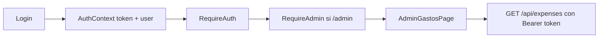
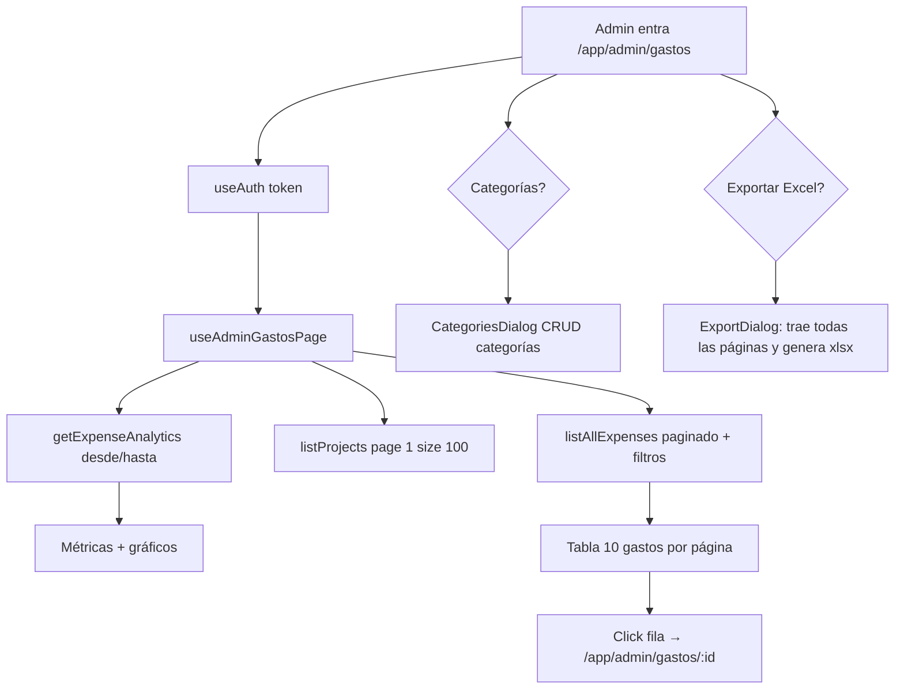

# Guía de defensa — Auth y Admin Gastos (frontend)

Documento para **entender y defender en un examen** dos bloques del frontend Macabi:

1. **Acceso y sesión** — login, recuperar contraseña, `AuthContext` y guards (`RequireAuth` / `RequireAdmin`)
2. **Vista admin de gastos** (`/app/admin/gastos`) — métricas, analytics, filtros en URL y listado paginado

Está pensado para alguien con **poco conocimiento de React**. Combina:

- **Qué hace la app** (flujo funcional, diagramas, preguntas de examen).
- **Qué dice el código** — sección **[7. Apéndice — Código importante](#7-apéndice--código-importante-para-cuando-el-profesor-abre-el-repo)** con archivos y fragmentos clave.

No hace falta memorizar línea por línea: hay que poder **ubicar** cada archivo y **explicar** la secuencia router → context/hook → `*Api.ts` → mutation/query.

Para contexto general del stack y carpetas, ver [`GUIA-FRONTEND.md`](./GUIA-FRONTEND.md).  
Para usuarios y jornadas (otro compañero), ver [`GUIA-FLUJOS-ADMIN-USUARIOS-JORNADAS.md`](./GUIA-FLUJOS-ADMIN-USUARIOS-JORNADAS.md).

> **Tip:** Si el profesor abre el IDE, empezá por la [sección 7](#7-apéndice--código-importante-para-cuando-el-profesor-abre-el-repo) y seguí el hilo `main.tsx` → `AuthContext` → `LoginPage` → `RequireAuth` → `AdminGastosPage`.

---

## 1. Antes de empezar: ideas mínimas

| Concepto | Explicación simple |
|----------|-------------------|
| **SPA** | Una sola página web que cambia de “pantalla” sin recargar el navegador. Cada pantalla es una **ruta** (URL). |
| **Ruta / URL** | Dirección del navegador. Ej.: `/` es login; `/app/admin/gastos` es gastos admin. |
| **Context (`AuthContext`)** | Estado **global** de sesión (`token`, `user`) accesible desde cualquier componente con `useAuth()`. |
| **Token JWT** | Clave que devuelve el backend al loguearse. Se guarda en `localStorage` y se manda en header `Authorization: Bearer …` en cada request autenticado. |
| **`isRestoring`** | Flag del contexto: “todavía estoy leyendo sesión guardada y validando con el servidor”. Evita redirigir al login antes de tiempo. |
| **Guard (`RequireAuth`)** | Componente del router que **bloquea** rutas si no hay sesión. |
| **TanStack Query** | Cachea lecturas (`useQuery`) y escrituras (`useMutation`) al API. |
| **Query string en URL** | Parámetros después de `?` (ej. `?q=viaje&estado=PENDIENTE`). En gastos admin persisten filtros. |

### Rutas relevantes (auth + gastos)

Definidas en `src/router.tsx`:

| Ruta | Pantalla | ¿Requiere login? |
|------|----------|------------------|
| `/` | `LoginPage` | No |
| `/recuperar-password` | `RecuperarPasswordPage` | No |
| `/restablecer-contrasena?token=…` | `RestablecerContrasenaPage` | No |
| `/aceptar-invitacion?token=…` | `AceptarInvitacionPage` | No *(flujo usuarios — otra guía)* |
| `/app/*` | Panel, gastos propios, etc. | Sí (`RequireAuth`) |
| `/app/admin/gastos` | `AdminGastosPage` | Sí + rol **admin** (`RequireAdmin`) |
| `/app/admin/gastos/:id` | `ExpenseDetailPage` | Sí + admin |

En el menú lateral admin (`layouts/AppShellLayout/navItems.ts`) aparece **Gastos** → `/app/admin/gastos`.

### Relación entre auth y gastos admin



**Frase clave:** “Sin sesión no llegás a gastos admin; con sesión de usuario normal tampoco — hace falta `user.role === 'admin'`.”

---

## 2. Flujo A — Auth (sesión, login, recuperar contraseña)

### 2.1. Qué problema resuelve

Macabi **no tiene registro público**. La persona entra solo si:

1. Fue **invitada** y ya creó contraseña *(explicado en la guía de usuarios)*, o
2. Ya tiene cuenta y **inicia sesión** con email + contraseña.

Si olvidó la contraseña, puede **pedir un link por email** y elegir una nueva — sin estar logueada.

El frontend debe:

- Recordar la sesión entre recargas (`localStorage`).
- Validar que el token siga vigente (`GET /api/me`).
- Proteger rutas privadas y el área admin.
- Enviar el token en cada llamada autenticada.

### 2.2. Mapa visual del flujo

```mermaid
flowchart TD
  A[Usuario abre la app] --> B{Hay sesión en localStorage?}
  B -->|No| C[isRestoring = false → Login /]
  B -->|Sí| D[getMe con token guardado]
  D -->|OK| E[Sesión activa → puede ir a /app]
  D -->|Error| F[Borra sesión → Login /]
  C --> G[POST /auth/login]
  G -->|OK| H[setSession token + user]
  H --> I[Navigate /app]
  C --> J[/recuperar-password]
  J --> K[POST /auth/forgot-password]
  K --> L[Email con link]
  L --> M[/restablecer-contrasena?token=...]
  M --> N[POST /auth/reset-password]
  N --> O[Volver al login /]
  E --> P{Entra a /app/admin?}
  P -->|role admin| Q[AdminGastosPage etc.]
  P -->|role user| R[Redirige a /app]
```

### 2.3. AuthContext — el “cerebro” de la sesión

**Archivo:** `src/contexts/AuthContext.tsx`  
**Montado en:** `src/providers/AppProviders.tsx` (envuelve toda la app en `main.tsx`).

#### Qué guarda

| Campo | Significado |
|-------|-------------|
| `token` | JWT actual o `null` |
| `user` | `UserDTO` (id, name, email, role, …) |
| `isRestoring` | `true` mientras bootstrap inicial |
| `isAuthenticated` | `Boolean(token && user)` |
| `setSession` | Guarda token + user en estado y `localStorage` |
| `logout` | Limpia todo (+ desuscribe push si aplica) |

#### Bootstrap al abrir la app

1. Lee `localStorage` (`macabi_auth`).
2. Si hay token, lo pone en estado y llama **`getMe(token)`** para refrescar usuario.
3. Si `getMe` falla (token expirado), **borra** la sesión.
4. Al final: `isRestoring = false`.

**Por qué importa:** `RequireAuth` muestra un spinner mientras `isRestoring`; no manda al login hasta saber si la sesión guardada es válida.

**Código:** [7.2](#72-authcontext-bootstrap-de-sesión) · [7.6](#76-api-de-auth-libapiauthts)

### 2.4. Login

**Archivo:** `src/pages/auth/LoginPage.tsx`  
**API:** `login()` → **`POST /auth/login`** con `{ email, password }`

#### Pasos para el usuario

1. Ingresa email y contraseña.
2. Clic en **Ingresar**.
3. Si es correcto, entra al panel (`/app`).

#### Qué pasa en el código

1. Validación local: email y contraseña no vacíos.
2. `loginMutation` (TanStack Query) llama a `login()`.
3. En éxito: `setSession(data.token, data.user)` + `navigate('/app')`.
4. En error: mensaje del servidor (`ApiError`).
5. Si **ya** está autenticado (`isAuthenticated`), redirige a `/app` sin mostrar el form.

**Link en UI:** “¿La olvidaste?” → `/recuperar-password`.

**Código:** [7.3](#73-login-loginpagetsx)

### 2.5. Recuperar contraseña (dos pantallas)

Flujo **público** (no requiere token de sesión).

#### Paso 1 — Pedir el link

**Archivo:** `src/pages/auth/RecuperarPasswordPage.tsx`  
**API:** `requestPasswordReset({ email })` → **`POST /auth/forgot-password`**

- Valida email no vacío y con `@`.
- Si sale bien, pantalla de éxito (mensaje genérico: no revela si el email existe).
- El backend envía mail con link a `/restablecer-contrasena?token=…`.

#### Paso 2 — Elegir nueva contraseña

**Archivo:** `src/pages/auth/RestablecerContrasenaPage.tsx`  
**API:** `confirmPasswordReset({ token, new_password })` → **`POST /auth/reset-password`**

- Lee `token` de la URL (`useSearchParams`).
- Valida: token presente, mínimo 8 caracteres, confirmación igual.
- Éxito → mensaje y botón “Ir al inicio de sesión”.

**Importante para el examen:** el token del reset **no** es el JWT de sesión — es un token de un solo uso que viene en el link del email.

**Código:** [7.4](#74-recuperar-y-restablecer-contraseña)

### 2.6. Guards — quién puede ver qué

| Guard | Archivo | Regla |
|-------|---------|-------|
| `RequireAuth` | `src/auth/RequireAuth.tsx` | Sin sesión → redirect `/` |
| `RequireAdmin` | `src/auth/RequireAdmin.tsx` | `user.role !== 'admin'` → redirect `/app` |

En `router.tsx`:

- `/app` está dentro de `RequireAuth`.
- `/app/admin/*` tiene un hijo extra `RequireAdmin`.

**Código:** [7.5](#75-guards-requireauth--requireadmin)

### 2.7. Cómo viaja el token al API

**Archivo:** `src/lib/api/apiClient.ts`

- Funciones como `getMe`, `listAllExpenses` reciben `token` como argumento.
- `apiRequest` agrega header: `Authorization: Bearer ${token}`.
- Login y forgot-password **no** llevan token (son públicos).

### 2.8. Archivos clave — auth

```
main.tsx                              ← AppProviders + RouterProvider
providers/AppProviders.tsx            ← QueryClient + AuthProvider
contexts/AuthContext.tsx              ← Sesión global
hooks/useAuth.ts                      ← Re-export del context
pages/auth/LoginPage.tsx
pages/auth/RecuperarPasswordPage.tsx
pages/auth/RestablecerContrasenaPage.tsx
auth/RequireAuth.tsx
auth/RequireAdmin.tsx
lib/api/auth.ts                       ← login, getMe, forgot, reset
lib/api/apiClient.ts                  ← Bearer token en requests
router.tsx                            ← Rutas públicas vs /app vs /app/admin
```

### 2.9. Preguntas típicas de examen — auth

| Pregunta | Respuesta corta |
|----------|-----------------|
| ¿Dónde vive la sesión? | `AuthContext` + persistencia en `localStorage` (`macabi_auth`). |
| ¿Qué es `isRestoring`? | Evita flash: mientras valida sesión guardada con `getMe`, no redirige al login. |
| ¿Cómo entra un usuario? | `POST /auth/login` → `setSession` → navega a `/app`. |
| ¿Hay registro público en login? | **No.** Solo credenciales; cuentas nuevas vienen por invitación (otra guía). |
| ¿Cómo recupera contraseña? | `forgot-password` → email → `reset-password` con token en URL. |
| ¿Difference token login vs token reset? | JWT de sesión (Bearer en API) vs token de un solo uso en el link del mail. |
| ¿Quién entra a `/app/admin/gastos`? | Usuario logueado **y** `role === 'admin'`. |
| ¿Dónde se pone el token en HTTP? | `apiClient.ts`, header `Authorization`. |

---

## 3. Flujo B — Admin Gastos (métricas, filtros, listado)

### 3.1. Qué problema resuelve

El admin necesita una **vista global** de todos los gastos de la organización:

- Ver **totales y gráficos** por período.
- Filtrar por proyecto, estado, texto libre.
- **Paginar** el detalle sin cargar miles de filas en el navegador.
- **Exportar** a Excel y administrar **categorías** de gasto.

Los participantes cargan gastos desde `/app/gastos` (Mis gastos); el admin los **supervisa y aprueba** desde admin (detalle en `/app/admin/gastos/:id`).

### 3.2. Mapa visual del flujo



### 3.3. Pantalla principal — capas de la UI

**Archivo:** `src/pages/admin/AdminGastosPage.tsx`  
**Lógica de datos:** `src/features/expenses/hooks/useAdminGastosPage.ts`

De arriba hacia abajo el admin ve:

| Capa | Componente | Datos |
|------|------------|-------|
| Header | `PageHeader` | Botones **Categorías** y **Exportar Excel** |
| Período | `PeriodFilter` | `desde` / `hasta` (+ presets “Este mes”, etc.) |
| KPIs | `ExpenseStatusMetricsGrid` | Totales pendientes/aprobados/rechazados del período |
| Gráficos | `AnalyticsCard` | Por proyecto y por mes/semana |
| Listado | `ExpensesListCard` | Tabla paginada con filtros extra |

**Patrón página fina:** `AdminGastosPage` lee filtros de la URL, llama al hook, renderiza cards. La lógica de queries está en el hook.

### 3.4. Filtros en la URL (`useSearchParamState`)

A diferencia de usuarios/jornadas (estado solo en React), varios filtros de gastos **persisten en la query string**:

| Parámetro URL | Significado | Default |
|---------------|-------------|---------|
| `q` | Búsqueda texto | vacío |
| `proyecto` | ID proyecto o `all` | `all` |
| `estado` | `PENDIENTE` / `APROBADO` / `RECHAZADO` / `all` | `all` |
| `desde` | Fecha inicio `YYYY-MM-DD` | primer día del mes actual |
| `hasta` | Fecha fin | hoy |

**Hook:** `src/hooks/useSearchParamState.ts` — API tipo `useState` pero sincronizada con `useSearchParams`.

**Ventajas para el examen:** recargar la página mantiene filtros; se puede compartir un link con filtros; botón atrás del navegador funciona.

Al cambiar período o filtros, la página resetea **`page` a 1** (en la page o en el hook).

**Código:** [7.9](#79-filtros-en-url-usesearchparamstate)

### 3.5. Tres requests distintos (no confundir)

`useAdminGastosPage` dispara **tres queries** en paralelo:

| Query | Endpoint | Cuántos trae | Para qué |
|-------|----------|--------------|----------|
| `analyticsQ` | `GET /api/expenses/analytics?from=&to=` | Agregados | KPIs + gráficos |
| `projectsQ` | `GET /api/projects?page=1&page_size=100` | Hasta 100 proyectos | Combo “Proyecto” del listado |
| `listQ` | `GET /api/expenses?page=&page_size=10&…` | **10 gastos** por página | Tabla |

#### Listado paginado — detalle

1. `debouncedQuery = useDebouncedValue(query.trim())` (~300 ms).
2. `resetKey` = búsqueda debounced + proyecto + estado + fechas → vuelve a página 1.
3. `listAllExpenses(token, { page, pageSize: 10, q, projectId, status, from, to })`.
4. UI: `PaginationControls` (oculto si `total_pages <= 1`).

**Frase para el examen:** “La tabla va de a 10; el combo de proyectos trae 100 nombres en una sola página; el Excel exporta **todas** las páginas que coincidan con el filtro del dialog.”

**Código:** [7.8](#78-hook-useadmingastospage) · [7.10](#710-api-de-gastos-expensesapits)

### 3.6. Estados de un gasto

| Estado (API) | Significado admin |
|--------------|-------------------|
| `PENDIENTE` | Esperando revisión |
| `APROBADO` | Aceptado |
| `RECHAZADO` | Rechazado (con motivo en detalle) |

Labels en UI: `features/expenses/lib/status.ts` (`EXPENSE_STATUS_FILTER_OPTIONS`).

### 3.7. Categorías de gasto

**UI:** `CategoriesDialog.tsx` (botón en header)

- Lista categorías: `GET /api/expenses/categories`
- Crear: `POST …/categories`
- Eliminar: `DELETE …/categories/:id` (falla si hay gastos asociados)

Hook: `useExpenseCategories`. Invalida `queryKeys.expenses.categoriesRoot()`.

### 3.8. Exportar Excel

**UI:** `ExportDialog.tsx`

- El admin elige rango, proyecto y estado (defaults = filtros actuales de la pantalla).
- **`handleDownloadExcel`**: llama `listAllExpenses` con `pageSize: 500`, página 1, y si hay más páginas pide el resto en paralelo.
- Arma un `.xlsx` en el navegador con librería **xlsx** (no es un job en el servidor).

**Diferencia con la tabla:** export **sí** junta todas las páginas; la tabla **no**.

**Código:** [7.11](#711-exportdialog-excel-en-cliente)

### 3.9. Detalle de un gasto (admin)

Desde la tabla, cada fila enlaza a **`/app/admin/gastos/:id`** (`ExpenseDetailPage` — misma page que participante pero con base path admin).

Ahí el admin puede aprobar/rechazar, ver comprobante, etc. *(Detalle profundo opcional; foco de esta guía = listado admin.)*

### 3.10. Endpoints HTTP — gastos (admin)

| Acción | Método | Ruta |
|--------|--------|------|
| Listado global paginado | GET | `/api/expenses?page=&page_size=&q=&project_id=&status=&from=&to=` |
| Analytics del período | GET | `/api/expenses/analytics?from=&to=` |
| Detalle | GET | `/api/expenses/:id` |
| Categorías | GET/POST/DELETE | `/api/expenses/categories` |
| Proyectos (filtro) | GET | `/api/projects?page=1&page_size=100` |

### 3.11. Archivos clave — gastos admin

```
pages/admin/AdminGastosPage.tsx           ← Pantalla
features/expenses/hooks/useAdminGastosPage.ts
features/expenses/api/expensesApi.ts
features/expenses/components/admin/
  AnalyticsCard.tsx
  ExpensesListCard.tsx
  CategoriesDialog.tsx
  ExportDialog.tsx
features/expenses/components/
  PeriodFilter.tsx
  ExpenseStatusMetricsGrid.tsx
hooks/useSearchParamState.ts
hooks/useDebouncedValue.ts
lib/datePresets.ts                        ← DEFAULT_DESDE / DEFAULT_HASTA
lib/pagination.ts                         ← PAGE_SIZE = 10
```

### 3.12. Preguntas típicas de examen — gastos admin

| Pregunta | Respuesta corta |
|----------|-----------------|
| ¿Cuántos gastos trae la tabla? | **10 por página** (`PAGE_SIZE`). |
| ¿Por qué hay request de 100 proyectos? | Solo para llenar el **filtro** del listado, no la tabla. |
| ¿Dónde están los filtros guardados? | En la **URL** (`useSearchParamState`). |
| ¿Analytics y listado usan las mismas fechas? | Sí: `desde`/`hasta` de la URL alimentan ambos. |
| ¿Cómo funciona la búsqueda `q`? | Debounce ~300 ms → param `q` en `GET /api/expenses`. |
| ¿Export Excel trae todo? | Sí: recorre páginas de a 500 en el cliente y genera xlsx. |
| ¿Qué token usa? | El mismo `token` de `useAuth()` en cada `apiRequest`. |
| ¿Mis gastos vs admin? | Participante: `/app/gastos`; admin global: `/app/admin/gastos`. |

---

## 4. Comparación rápida entre ambos flujos

| Aspecto | Auth | Admin Gastos |
|---------|------|--------------|
| ¿Requiere login previo? | Es el flujo de login | **Sí** — usa `token` del context |
| Pantallas públicas | `/`, recuperar, restablecer | Ninguna |
| Estado global | `AuthContext` | Token leído con `useAuth()` |
| Persistencia | `localStorage` | Filtros en **URL** (query string) |
| TanStack Query | Mutations (login, reset) | Queries (analytics, list, projects) |
| Paginación | — | Server-side, 10 por página |
| Feature folder | `contexts/`, `lib/api/auth.ts` | `features/expenses/` |
| Patrón página | Formularios + mutation | Page fina + `useAdminGastosPage` |

**Puente con tu compañero:** ellos explican **invitación** (`/aceptar-invitacion`); vos explicás **login + reset password** — flujos públicos similares (form → POST → mensaje).

---

## 5. Cómo estudiar para defender el código

1. **Recorré la app:** logout → login → entrá a `/app/admin/gastos` → cambiá período → filtrá por estado → buscá texto → mirá Network.
2. **Probá recuperar password** en dev (si el backend manda mail o loguea el link).
3. **Leé la sección 7** con el IDE abierto: auth primero, gastos después.
4. **Seguí el router** (`router.tsx`): qué rutas son públicas y dónde están los guards.
5. **Memorizá secuencias**, no JSX: login → `setSession` → token en header → query admin.

### Frases modelo para el examen

> “La sesión vive en `AuthContext`: al abrir la app leemos `localStorage`, validamos con `GET /api/me`, y mientras tanto `isRestoring` evita mandar al login antes de tiempo. `RequireAuth` protege `/app` y `RequireAdmin` el prefijo `/app/admin`.”

> “En gastos admin hay tres lecturas paralelas: analytics del período, hasta 100 proyectos para el filtro, y el listado paginado de a 10 gastos con `q` debounced. Los filtros van en la URL con `useSearchParamState`; el export a Excel sí recorre todas las páginas en el cliente.”

---

## 6. Glosario de archivos compartidos (ambos flujos)

| Archivo | Uso |
|---------|-----|
| `main.tsx` | Monta `AppProviders` + router |
| `providers/AppProviders.tsx` | QueryClient + AuthProvider + Toaster |
| `contexts/AuthContext.tsx` | Sesión global |
| `hooks/useAuth.ts` | Acceso al context |
| `auth/RequireAuth.tsx` / `RequireAdmin.tsx` | Guards de rutas |
| `lib/api/apiClient.ts` | `apiRequest` + Bearer token |
| `lib/api/auth.ts` | Login, getMe, reset password |
| `lib/queryKeys.ts` | Claves TanStack Query |
| `hooks/useDebouncedValue.ts` | Búsqueda server-side sin spam al API |
| `hooks/useSearchParamState.ts` | Filtros gastos en URL |
| `lib/pagination.ts` | `PAGE_SIZE = 10` |
| `components/PageHeader.tsx` | Título + acciones |

---

## 7. Apéndice — Código importante (para cuando el profesor abre el repo)

Convención: `// ...` indica líneas omitidas.

---

### 7.1. Montaje de la app — main + router auth

**Archivos:** `src/main.tsx` · `src/router.tsx` (recorte)

```tsx
// main.tsx
createRoot(document.getElementById('root')!).render(
  <StrictMode>
    <AppProviders>
      <RouterProvider router={router} />
    </AppProviders>
  </StrictMode>,
)
```

```tsx
// router.tsx — rutas públicas y admin gastos
{ path: '/', element: <LoginPage /> },
{ path: '/recuperar-password', element: <RecuperarPasswordPage /> },
{ path: '/restablecer-contrasena', element: <RestablecerContrasenaPage /> },
{
  path: '/app',
  element: <RequireAuth />,
  children: [{
    element: <AppShellLayout />,
    children: [
      // ...
      {
        path: 'admin',
        element: <RequireAdmin />,
        children: [
          { path: 'gastos', element: <AdminGastosPage /> },
          { path: 'gastos/:id', element: <ExpenseDetailPage /> },
        ],
      },
    ],
  }],
}
```

**Qué decir:** “Toda la app cuelga de `AuthProvider`. Las rutas `/app` exigen sesión; `/app/admin` además exige rol admin.”

---

### 7.2. AuthContext — bootstrap de sesión

**Archivo:** `src/contexts/AuthContext.tsx`

```tsx
useEffect(() => {
  async function bootstrap() {
    const stored = readStoredSession()
    if (!stored) {
      setIsRestoring(false)
      return
    }
    setToken(stored.token)
    setUser(stored.user)
    try {
      const fresh = await getMe(stored.token)
      setUser(fresh)
      writeStoredSession({ token: stored.token, user: fresh })
    } catch {
      setToken(null)
      setUser(null)
      writeStoredSession(null)
    } finally {
      setIsRestoring(false)
    }
  }
  void bootstrap()
}, [])

const setSession = useCallback((nextToken, nextUser) => {
  setToken(nextToken)
  setUser(nextUser)
  writeStoredSession({ token: nextToken, user: nextUser })
}, [])
```

**Qué decir:** “No confiamos ciegamente en localStorage: siempre refrescamos el usuario con `getMe`. Si el token murió, limpiamos sesión.”

---

### 7.3. Login — LoginPage.tsx

```tsx
const loginMutation = useMutation({
  mutationFn: () => login({ email: email.trim(), password }),
  onSuccess: (data) => {
    setSession(data.token, data.user)
    navigate('/app', { replace: true })
  },
})

if (!isRestoring && isAuthenticated) {
  return <Navigate to="/app" replace />
}
```

**Qué decir:** “Login es una mutation, no una query: escribe sesión y redirige. Si ya hay sesión válida, ni muestra el form.”

---

### 7.4. Recuperar y restablecer contraseña

```tsx
// RecuperarPasswordPage — forgot
forgotMutation.mutate() // → POST /auth/forgot-password

// RestablecerContrasenaPage
const token = searchParams.get('token')
confirmPasswordReset({ token, new_password: password })
// → POST /auth/reset-password
```

**Qué decir:** “Son dos pantallas públicas encadenadas por el email. El token va en la URL del segundo paso, no en localStorage.”

---

### 7.5. Guards — RequireAuth / RequireAdmin

```tsx
// RequireAuth.tsx
if (isRestoring) return <Loader2 … />
if (!isAuthenticated) return <Navigate to="/" replace />
return <Outlet />

// RequireAdmin.tsx
if (user?.role !== 'admin') return <Navigate to="/app" replace />
return <Outlet />
```

**Qué decir:** “Los guards son layouts del router: no renderizan hijos si no cumplís la condición.”

---

### 7.6. API de auth — lib/api/auth.ts

```tsx
export async function login(body: LoginBody) {
  return apiRequest('/auth/login', { method: 'POST', body })
}

export async function getMe(token: string) {
  return apiRequest('/api/me', { method: 'GET', token })
}

export async function requestPasswordReset(body: { email: string }) {
  return apiRequest('/auth/forgot-password', { method: 'POST', body })
}

export async function confirmPasswordReset(body: ConfirmPasswordResetBody) {
  return apiRequest('/auth/reset-password', { method: 'POST', body })
}
```

**Qué decir:** “Centralizamos endpoints de identidad en `auth.ts`; el resto del dominio usa `*Api.ts` por feature.”

---

### 7.7. Página fina — AdminGastosPage

**Archivo:** `src/pages/admin/AdminGastosPage.tsx`

```tsx
const { token, isRestoring } = useAuth()
const [query, setQuery] = useSearchParamState('q', '')
const [projectFilter, setProjectFilter] = useSearchParamState('proyecto', 'all')
const [statusFilter, setStatusFilter] = useSearchParamState('estado', 'all')
const [desde, setDesde] = useSearchParamState('desde', DEFAULT_DESDE)
const [hasta, setHasta] = useSearchParamState('hasta', DEFAULT_HASTA)

const { page, setPage, analyticsQ, listQ, projectOptions, expenses } =
  useAdminGastosPage(token, isRestoring, {
    query, projectFilter, statusFilter, desde, hasta,
  })
```

**Qué decir:** “La page sincroniza filtros con la URL; el hook concentra las tres queries al backend.”

---

### 7.8. Hook — useAdminGastosPage

**Archivo:** `src/features/expenses/hooks/useAdminGastosPage.ts`

```tsx
const debouncedQuery = useDebouncedValue(query.trim())
const resetKey = [debouncedQuery, projectFilter, statusFilter, desde, hasta].join('\0')
// … reset page a 1 si cambia resetKey

const analyticsQ = useQuery({
  queryKey: queryKeys.expenses.analytics(token, desde, hasta),
  queryFn: () => getExpenseAnalytics(token!, desde || undefined, hasta || undefined),
})

const projectsQ = useQuery({
  queryFn: () => listProjects(token!, { page: 1, pageSize: 100 }),
})

const listQ = useQuery({
  queryKey: queryKeys.expenses.adminList(token, page, projectFilter, statusFilter, desde, hasta, debouncedQuery),
  queryFn: () =>
    listAllExpenses(token!, {
      page,
      pageSize: PAGE_SIZE,
      projectId: projectFilter,
      status: statusFilter,
      from: desde || undefined,
      to: hasta || undefined,
      q: debouncedQuery,
    }),
})
```

**Qué decir:** “Tres fuentes de datos distintas; la tabla usa debounce y paginación; proyectos solo alimentan el select.”

---

### 7.9. Filtros en URL — useSearchParamState

```tsx
export function useSearchParamState(key: string, defaultValue: string) {
  const [searchParams, setSearchParams] = useSearchParams()
  const value = searchParams.get(key) ?? defaultValue
  const setValue = (next: string) => {
    setSearchParams((prev) => {
      const params = new URLSearchParams(prev)
      if (!next || next === defaultValue) params.delete(key)
      else params.set(key, next)
      return params
    }, { replace: true })
  }
  return [value, setValue]
}
```

**Qué decir:** “Si el valor es el default, borramos el param para URLs limpias.”

---

### 7.10. API de gastos — expensesApi.ts

```tsx
export function listAllExpenses(token: string, f: ExpenseListFilters = {}) {
  const q = new URLSearchParams({
    page: String(f.page ?? 1),
    page_size: String(f.pageSize ?? 20),
  })
  if (f.projectId && f.projectId !== 'all') q.set('project_id', f.projectId)
  if (f.status && f.status !== 'all') q.set('status', f.status)
  if (f.from) q.set('from', f.from)
  if (f.to) q.set('to', f.to)
  if (f.q?.trim()) q.set('q', f.q.trim())
  return apiRequest(`/api/expenses?${q}`, { token })
}

export function getExpenseAnalytics(token: string, from?: string, to?: string) {
  // GET /api/expenses/analytics?from=&to=
}
```

**Qué decir:** “Un solo módulo API para gastos; admin pasa token en cada llamada.”

---

### 7.11. ExportDialog — Excel en cliente

```tsx
const FETCH_SIZE = 500
const first = await listAllExpenses(token, { ...filters, page: 1, pageSize: FETCH_SIZE })
const all = [...first.data]
if (first.total_pages > 1) {
  const rest = await Promise.all(
    Array.from({ length: first.total_pages - 1 }, (_, i) =>
      listAllExpenses(token, { ...filters, page: i + 2, pageSize: FETCH_SIZE }),
    ),
  )
  rest.forEach((r) => all.push(...r.data))
}
// … XLSX.writeFile(workbook, 'gastos-macabi.xlsx')
```

**Qué decir:** “Export no usa endpoint especial: pagina el mismo listado con page_size grande y arma el Excel en el navegador.”

---

### 7.12. Mapa rápido: pregunta → archivo

| Si preguntan… | Abrí… | Mirá… |
|---------------|-------|-------|
| ¿Dónde arranca la app? | `main.tsx` | `AppProviders` |
| ¿Dónde está la sesión? | `AuthContext.tsx` | `bootstrap`, `setSession` |
| ¿Cómo logueo? | `LoginPage.tsx` | `loginMutation` + `setSession` |
| ¿Endpoint login? | `lib/api/auth.ts` | `login` → POST `/auth/login` |
| ¿Recuperar contraseña? | `RecuperarPasswordPage.tsx` | `requestPasswordReset` |
| ¿Nueva contraseña? | `RestablecerContrasenaPage.tsx` | `confirmPasswordReset` + `?token=` |
| ¿Protección de rutas? | `RequireAuth.tsx`, `RequireAdmin.tsx` | condiciones + `Navigate` |
| ¿Admin gastos UI? | `AdminGastosPage.tsx` | filtros URL + hook |
| ¿Queries de gastos? | `useAdminGastosPage.ts` | analytics + projects + list |
| ¿Filtros en URL? | `useSearchParamState.ts` | `setSearchParams` |
| ¿Cuántos por página? | `lib/pagination.ts` | `PAGE_SIZE = 10` |
| ¿Export Excel? | `ExportDialog.tsx` | loop de páginas + xlsx |
| ¿Categorías? | `CategoriesDialog.tsx` | create/delete category |
| ¿Token en HTTP? | `apiClient.ts` | `Authorization: Bearer` |

---

*Última revisión: auth (login, reset, AuthContext, guards) + admin gastos (analytics, URL filters, listado paginado con debounce, export/categorías). Complementa [`GUIA-FLUJOS-ADMIN-USUARIOS-JORNADAS.md`](./GUIA-FLUJOS-ADMIN-USUARIOS-JORNADAS.md).*
